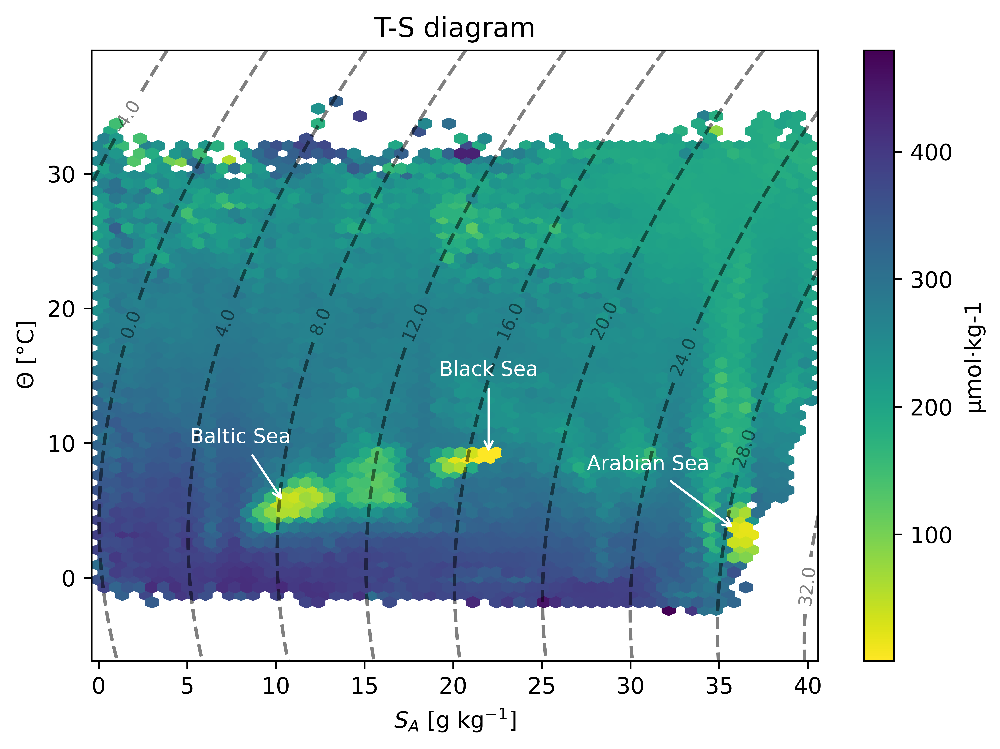

*Figure 1: Global temperature-salinity diagram (`comfort.plot`)
with isopycnals (dashed lines) of all quality-controlled (`QC_GOOD`) COMFORT observations. 
Absolute Salinity ($S_A$) and Conservative Temperature ($\Theta$) are derived via TEOS-10 (`comfort.physics`). 
Observation density is aggregated into hexagonal bins and coloured by oxygen concentration after harmonising units 
(`comfort.units`). The three visible low-oxygen zones in the plot correspond to known oxygen depleted areas 
in the Baltic, Black and Arabian Sea [@paulmier2009].*

## Summary
`comfort-db` is a Python library that facilitates working with the COMFORT SQLite database [@comfort_dataset2022]. 
The database assembles global oceanographic measurements from ten datasets and contains a total of 458,724,734 in-situ measurements from the years 1772 to 2020.
`comfort-db` enables easy access to the database and provides preprocessing and exploratory analysis utilities. 
Preprocessing supports variable scaling and filtering for space, time and quality. 
Unit conversions are implemented following [@comfort_report2021] and can easily be added during data loading or separately via a converter object. 
TEOS-10 physical oceanography (`comfort.physics`) is built on the `gsw` library [@mcdougall2011]. 
Gridding is supported and optionally works with bathymetry data to exclude grid cells on land.
Moreover, the library supports general and field-specific exploratory data analysis by plotting functions, an interactive dash app and functions to compute
oceanographic profile and water mass statistics. 

## Statement of need
Currently, a large preprocessing pipeline is required to work with the COMFORT database. 
Users must perform SQLite queries, interpret quality flags, convert units, which involves computing TEOS-10 variables and averaging temperature and salinity variables 
and, depending on the use case, interpolate profiles, perform scaling and gridding.
`comfort-db` integrates these tasks into one reproducible Python workflow and thus contributes to sustainable and transparent analyses built on the COMFORT database.
This enables users of the COMFORT dataset, oceanographers without a strong software background and data scientists without a strong oceanographic background, to 
focus on scientific questions rather than repeated, error-prone data preprocessing and wrangling. 

## State of the field
A similar library is argopy [@argopy2020] that enables data access, manipulation and visualisation of Argo float data. 
The COMFORT database is broader in scope, merging Argo float data with other in-situ sources such as ship-based measurements,
and has its own SQLite schema, quality flag conventions and unit definitions, which do not map onto argopy's NetCDF-based interface.
To our knowledge, no existing package offers a comparable reproducible interface to the COMFORT database.

## Software design
The organisation of the `comfort-db` library is driven by usability and the scale of the COMFORT database. Since the database
is distributed as a single multi-gigabyte SQLite file, efficiency and low memory load were key design goals. 
For example, space, time and quality filtering is applied on SQL level rather than after loading potentially large data tables into memory and 
computations were vectorised where possible, for example `distance_to_coast` and `classify_from_grid` functions use a 
KDTree for candidate search combined with vectorised distance calculations to avoid per-row iterations.

Quality flag interpretation and unit conversions are centralised in dedicated modules (`comfort.qc`, `comfort.units`) so 
that corrections and settings apply everywhere consistently. 
To cater to a diverse audience, heavier more specialised functionalities such as plotting, geospatial analysis, gridding, scaling and the Dash app,
are gated behind optional installs (`plot`, `geo`, `grid`, `scale`, `dash`). Thus, the core package stays lightweight for users who only
need database access and preprocessing.

Figure 1 was generated by example 9, which illustrates an exemplary comfort-db usage end-to-end: 
Quality filtering, TEOS-10 conversion and unit harmonisation was applied and 
the data was then rendered as a global temperature-salinity diagram coloured by oxygen concentration.

## Research impact statement
The COMFORT dataset provides a large compilation of oceanographic observations, including data from 
established resources such as the World Ocean Database [@boyer2018] and the Global Ocean Data Analysis Project [@olsen2016; @olsen2019].
Accessing, preprocessing and exploring this data can require substantial technical effort and 
`comfort-db` lowers the barrier to exploit this extensive resource to facilitate future analyses and reproducible 
workflows. 

To this point, [@jenniges2025] is the only published study using the COMFORT database and investigated three-dimensional
biogeochemical provinces in the North Atlantic. The upcoming [@jenniges2027] will apply the data to spatio-temporal imputation 
of North Atlantic biogeochemistry at 20-year intervals. The preprocessing of both studies can be closely reproduced
using `comfort-db` (examples 7 and 8, respectively), with minor numerical differences from refinements to the
density conventions since the original analyses.

## AI usage disclosure
Generative AI (Anthropic Claude, via Claude Code) was used under direct supervision of the corresponding author (Y. Jenniges) 
to re-structure the author's own pre-existing analysis scripts into an installable package, 
update accompanying documentation, draft the majority of the tests and 
assisted in identifying and fixing bugs. 
All code was reviewed by the corresponding author, who implemented the original scientific logic. 
Correctness was verified via the tests, checks against manually computed
unit conversions and execution of all example scripts. 

## Acknowledgements
The first author (Y. Jenniges) was funded through the University of Bremen and 
the Helmholtz School for Marine Data Science (MarDATA).
This work has been kindly supported by computing infrastructure of 
the Alfred-Wegener Institut, Helmholtz-Zentrum für Polar- und Meeresforschung. 
